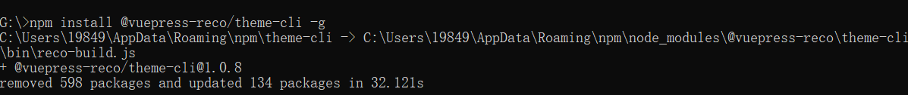
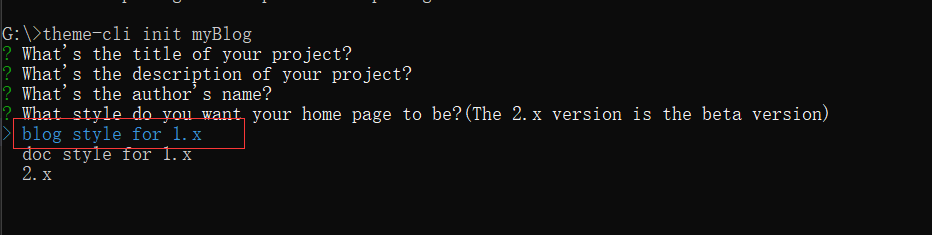

## vuepress介绍

Vue 驱动的静态网站生成器 

[vuepress官方文档](https://vuepress.vuejs.org/zh/)。

## 搭建博客步骤

### （一）阅读官方文档，了解目录结构及基本配置（重要！！！）

不要盲目跟从别人的博客，不然中途出现问题你都不知道为什么，至少先了解，之后遇到问题心理会大概知道是哪个地方出错了。

### （二）创建项目

ps：我是自己先跟着官方文档搭建了一个基本的项目试了试，之后找了一个主题☞[vuepress-theme-reco](https://vuepress-theme-reco.recoluan.com/views/1.x/)，参考[ VuePress博客美化之reco主题 ](https://www.cnblogs.com/glassysky/p/13387739.html)博客完成整个项目搭建以及配置。

直接运行下面的命令

>npm install @vuepress-reco/theme-cli -g



> theme-cli init 在这里写你的博客名字



安装时记得选blog，上面的描述可以填写，也可以直接回车跳过，之后在项目中再加上去。

打开创建的项目运行下面的命令，项目就可以跑起来了
>npm i

>npm run dev

### （三）配置文件

下面是我的配置文件，其中有一些我觉得好用的插件。

评论插件valineConfig中appId和appKey需要去创建应用申请，具体步骤参考：[Valine 官网](https://valine.js.org/quickstart.html)

```js
module.exports = {
  title: "凡年换酒柴1998",
  description: "天戴其苍，地履其黄。纵有千古，横有八荒。前途似海，来日方长。",
  head: [
    [
      "link",
      {
        rel: "icon",
        href: "/favicon.ico",
      },
    ],
    [
      "meta",
      {
        name: "viewport",
        content: "width=device-width,initial-scale=1,user-scalable=no",
      },
    ],
    ["link", { rel: "manifest", href: "/manifest.json" }],
    ["meta", { name: "theme-color", content: "#3eaf7c" }],
    ["meta", { name: "apple-mobile-web-app-capable", content: "yes" }],
    [
      "meta",
      { name: "apple-mobile-web-app-status-bar-style", content: "black" },
    ],
    [
      "link",
      { rel: "apple-touch-icon", href: "/icons/apple-touch-icon-152x152.png" },
    ],
    [
      "link",
      {
        rel: "mask-icon",
        href: "/icons/safari-pinned-tab.svg",
        color: "#3eaf7c",
      },
    ],
    [
      "meta",
      {
        name: "msapplication-TileImage",
        content: "/icons/msapplication-icon-144x144.png",
      },
    ],
    ["meta", { name: "msapplication-TileColor", content: "#000000" }],
  ],
  dest: "dist",
  theme: "reco",
  themeConfig: {
    nav: [
      {
        text: "主页",
        link: "/",
        icon: "reco-home",
      },
      {
        text: "时间线",
        link: "/timeline/",
        icon: "reco-date",
      },
    ],
    type: "blog",
    blogConfig: {
      category: {
        location: 2, // 在导航栏菜单中所占的位置，默认2
        text: "分类", // 默认 “分类”
      },
      tag: {
        location: 3, // 在导航栏菜单中所占的位置，默认3
        text: "标签", // 默认 “标签”
      },
      // socialLinks: [
      //   // 信息栏展示社交信息
      //   { icon: "reco-github", link: "https://github.com/recoluan", text: "1" },
      // ],
    },
    logo: "/logo.png",
    search: true,
    searchMaxSuggestions: 10,
    subSidebar: "auto",
    lastUpdated: "Last Updated",
    author: "凡年换酒柴1998🌸",
    authorAvatar: "/avatar.jpg",
    startYear: "2022",
    // 默认值是 true 。设置为 false 来禁用所有页面的 下一篇 链接
    nextLinks: true,
    // 默认值是 true 。设置为 false 来禁用所有页面的 上一篇 链接
    prevLinks: true,
    smoothScroll: true,
    valineConfig: {
      appId: "", // your appId
      appKey: "", // your appKey
      visitor: true,
      enableQQ: true,
    },
    mode: "light", // 默认 auto，auto 跟随系统，dark 暗色模式，light 亮色模式
    modePicker: false, // 默认 true，false 不显示模式调节按钮，true 则显示
  },
  markdown: {
    lineNumbers: true,
  },
  plugins: [
    [
      "@vuepress/pwa",
      {
        serviceWorker: true,
        updatePopup: true,
      },
    ],
    [
      "sakura",
      {
        // 默认数量
        num: 8,
        //是否显示
        show: true,
        // 层级
        zIndex: 200,
        img: {
          // false 默认图 true 换图 需要填写httpUrl地址
          // replace: true,
          // 绝对路径
          // httpUrl: "/vuepress-blog/docs/.vuepress/public/flower.png",
        },
      },
    ],
    [
      //先安装在配置， npm install @vuepress-reco/vuepress-plugin-kan-ban-niang --save
      "@vuepress-reco/vuepress-plugin-kan-ban-niang",
      {
        theme: ["whiteCat", "wanko"],
        clean: false,
        messages: {
          welcome: "欢迎来到我的博客",
          home: "学习使我快乐",
          theme: "好吧，希望你能喜欢我的其他小伙伴。",
          close: "再见哦",
        },
        messageStyle: {
          background: "#000",
          color: "#fff",
          right: "68px",
          bottom: "250px",
        },
        width: 240,
        height: 352,
      },
    ],
    [
      //github地址：https://github.com/moefyit/vuepress-plugin-cursor-effects
      "vuepress-plugin-cursor-effects",
      {
        // size of the particle, default: 2
        size: 3,
        // shape of the particle, default: 'star'
        shape: "star",
        // z-index property of the canvas, default: 999999999
        zIndex: 999999999,
      },
    ],
    [
      //动态标题 先安装在配置， npm install vuepress-plugin-dynamic-title --save
      "dynamic-title",
      {
        showIcon: "/favicon.ico",
        showText: "🌸加载成功了耶",
        hideIcon: "/failure.ico",
        hideText: "🥀哎呀，加载失败啦",
        recoverTime: 2000,
      },
    ],
    [
      //插件广场的流程图插件 先安装在配置 npm install vuepress-plugin-flowchart --save
      "flowchart",
    ],
    [
      //插件广场的sitemap插件 先安装在配置 npm install vuepress-plugin-sitemap --save
      "sitemap",
      {
        hostname: "https://www.glassysky.site",
      },
    ],
    [
      "vuepress-plugin-nuggets-style-copy",
      {
        copyText: "复制代码", //vuepress复制粘贴提示插件P 先安装在配置 npm install vuepress-plugin-nuggets-style-copy --save
        tip: {
          content: "复制成功!",
        },
      },
    ],
    ["@vuepress-reco/extract-code"],
  ],
};

```

### (四)主页配置

```md
---
home: true
heroText: 凡年换酒柴1998
tagline: 天戴其苍，地履其黄。纵有千古，横有八荒。前途似海，来日方长。
bgImage: '/bg.jpg'
bgImageStyle: {
  height: '450px',
}
isShowTitleInHome: false
---
```

### (五)自定义主题

简单的方法就是将node_modules中的主题代码全部拷贝粘贴到.vuepress文件夹下的theme文件夹下。然后自己更改其中的代码，自定义样式以及布局等。