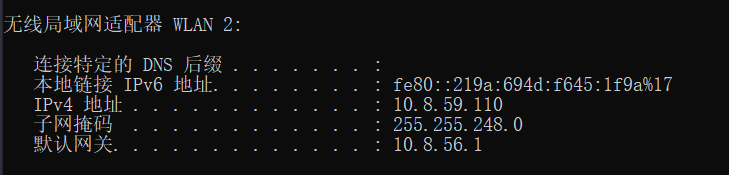

## ipconfig(window)/ifconfig(Linux)

IP地址是一个网卡在网络世界的通讯地址，相当于我们现实世界的门牌号码。

10.8.59.110就是一个IP地址。这个地址被点分隔为四个部分，每个部分8个bit，所以IP地址总共是32位。因为不够用，于是就有了IPv6，也就是上面输出结果里面IPv6 fe80::219a:694d:f645:1f9a%17。这个有128位，

在网络地址中，至少在当时设计的时候，对于A、B、 C类主要分两部分，前面一部分是网络号，后面一部分是主机号。

下面这个表格，详细地展示了A、B、C三类地址所能包含的主机的数量。

这里面有个尴尬的事情，就是C类地址能包含的最大主机数量实在太少了，只有254个。当时设计的时候恐怕没想到，现在估计一个网吧都不够用吧。而B类地址能包含的最大主机数量又太多了。6万多台机器放在一个网络下面，一般的企业基本达不到这个规模，闲着的地址就是浪费。

### 无类型域间选路（CIDR）

于是有了一个折中的方式叫作**无类型域间选路**，简称**CIDR**。这种方式打破了原来设计的几类地址的做法，将32位的IP地址一分为二，前面是**网络号**，后面是**主机号**。从哪里分呢？你如果注意观察的话可以看到，10.100.122.2/24，这个IP地址中有一个斜杠，斜杠后面有个数字24。这种地址表示形式，就是CIDR。后面24的意思是，32位中，前24位是网络号，后8位是主机号。

伴随着CIDR存在的，一个是**广播地址**，10.100.122.255。如果发送这个地址，所有10.100.122网络里面的机器都可以收到。另一个是**子网掩码**，255.255.255.0。

将子网掩码和IP地址进行AND计算。前面三个255，转成二进制都是1。1和任何数值取AND，都是原来数值，因而前三个数不变，为10.100.122。后面一个0，转换成二进制是0，0和任何数值取AND，都是0，因而最后一个数变为0，合起来就是10.100.122.0。这就是**网络号**。**将子网掩码和IP地址按位计算AND，就可得到网络号。**

### 举例：一个容易“犯错”的CIDR

我们来看16.158.165.91/22这个CIDR。求一下这个网络的第一个地址、子网掩码和广播地址。

你要是上来就写16.158.165.1，那就大错特错了。

/22不是8的整数倍，不好办，只能先变成二进制来看。16.158的部分不会动，它占了前16位。中间的165，变为二进制为‭10100101‬。除了前面的16位，还剩6位。所以，这8位中前6位是网络号，16.158.<101001>，而<01>.91是机器号。

第一个地址是16.158.<101001><00>.1，即16.158.164.1。子网掩码是255.255.<111111><00>.0，即255.255.252.0。广播地址为16.158.<101001><11>.255，即16.158.167.255。

这五类地址中，还有一类D类是**组播地址**。使用这一类地址，属于某个组的机器都能收到。这有点类似在公司里面大家都加入了一个邮件组。发送邮件，加入这个组的都能收到。组播地址在后面讲述VXLAN协议的时候会提到。

讲了这么多，才讲了上面的输出结果中很小的一部分，是不是觉得原来并没有真的理解ip addr呢？我们接着来分析。

在IP地址的后面有个scope，对于eth0这张网卡来讲，是global，说明这张网卡是可以对外的，可以接收来自各个地方的包。对于lo来讲，是host，说明这张网卡仅仅可以供本机相互通信。

lo全称是**loopback**，又称**环回接口**，往往会被分配到127.0.0.1这个地址。这个地址用于本机通信，经过内核处理后直接返回，不会在任何网络中出现。

### MAC地址

在IP地址的上一行是link/ether fa:16:3e:c7:79:75 brd ff:ff:ff:ff:ff:ff，这个被称为**MAC地址**，是一个网卡的物理地址，用十六进制，6个byte表示。

MAC地址是一个很容易让人“误解”的地址。因为MAC地址号称全局唯一，不会有两个网卡有相同的MAC地址，而且网卡自生产出来，就带着这个地址。很多人看到这里就会想，既然这样，整个互联网的通信，全部用MAC地址好了，只要知道了对方的MAC地址，就可以把信息传过去。

这样当然是不行的。 **一个网络包要从一个地方传到另一个地方，除了要有确定的地址，还需要有定位功能。** 而有门牌号码属性的IP地址，才是有远程定位功能的。

例如，你去杭州市网商路599号B楼6层找刘超，你在路上问路，可能被问的人不知道B楼是哪个，但是可以给你指网商路怎么去。但是如果你问一个人，你知道这个身份证号的人在哪里吗？可想而知，没有人知道。

MAC地址更像是身份证，是一个唯一的标识。

它的唯一性设计是为了组网的时候，不同的网卡放在一个网络里面的时候，可以不用担心冲突。从硬件角度，保证不同的网卡有不同的标识。

MAC地址是有一定定位功能的，只不过范围非常有限。你可以根据IP地址，找到杭州市网商路599号B楼6层，但是依然找不到我，你就可以靠吼了，大声喊身份证XXXX的是哪位？我听到了，我就会站起来说，是我啊。但是如果你在上海，到处喊身份证XXXX的是哪位，我不在现场，当然不会回答，因为我在杭州不在上海。

所以，MAC地址的通信范围比较小，局限在一个子网里面。例如，从192.168.0.2/24访问192.168.0.3/24是可以用MAC地址的。一旦跨子网，即从192.168.0.2/24到192.168.1.2/24，MAC地址就不行了，需要IP地址起作用了。

### 小结

怎么样，看起来很简单的一个命令，里面学问很大吧？通过这一节，希望你能记住以下的知识点，后面都能用得上：

- IP是地址，有定位功能；MAC是身份证，无定位功能；

- CIDR可以用来判断是不是本地人；

- IP分公有的IP和私有的IP。后面的章节中我会谈到“出国门”，就与这个有关。