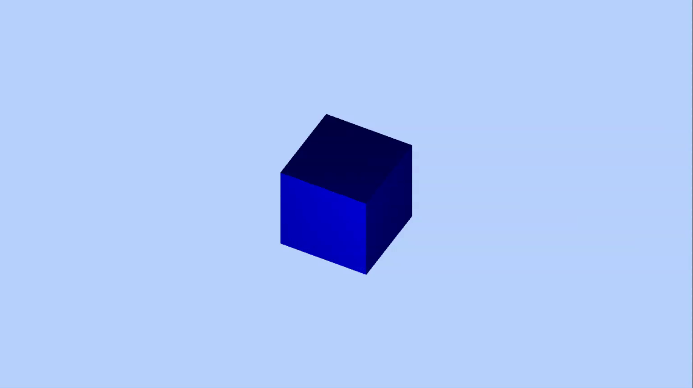

## 介绍

[three.js地址](https://github.com/mrdoob/three.js)

**目录内容：**


**使用：**

```html
<!--相对地址加载-->
<script src="./three.js"></script>
```

在.html文件引入three.js后可以通过THREE访问所有的API。

## 第一个3D场景

[demo](https://sly1998.github.io/threeJs-example/1-1.html)

**实现步骤：**

- 创建场景对象scene
```js
var scene = new THREE.Scene();
```

- 创建网格模型，并将网格模型添加到场景中
```js
// 创建一个立方体几何对象Geometry
var geometry = new THREE.BoxGeometry(100, 100, 100); 

// 材质对象Material
var material = new THREE.MeshLambertMaterial({
      color: 0x0000ff
    }); 

// 网格模型对象Mesh
var mesh = new THREE.Mesh(geometry, material);

// 将网格模型添加到场景中
scene.add(mesh);
```

- 添加光源
>参数0xffffff定义的是光照强度

```js
/**
 * 光源设置
 */
// 点光源
var point = new THREE.PointLight(0xffffff);
point.position.set(400, 200, 300); // 点光源位置
scene.add(point); // 点光源添加到场景中
// 环境光
var ambient = new THREE.AmbientLight(0x444444);
scene.add(ambient);
```

- 相机设置

>相机可以缩放显示三维场景、对三维场景的不同角度进行取景显示

>相机构造函数的的前四个参数定义的是拍照窗口大小， 就像平时拍照一样，取景范围越大，被拍的人相对背景自然变小了。

```js
var width = window.innerWidth; // 窗口宽度
var height = window.innerHeight; // 窗口高度
var k = width / height; // 窗口宽高比
var s = 200; // 三维场景显示范围控制系数，系数越大，显示的范围越大
// 创建相机对象
var camera = new THREE.OrthographicCamera(-s * k, s * k, s, -s, 1, 1000);
camera.position.set(200, 300, 200); // 设置相机位置
camera.lookAt(scene.position); // 设置相机方向(指向的场景对象)
```

- 创建渲染器对象，执行渲染操作

```js
var renderer = new THREE.WebGLRenderer(); // 创建渲染器对象
renderer.setSize(width, height);// 设置渲染区域尺寸
renderer.setClearColor(0xb9d3ff, 1); // 设置背景颜色
document.body.appendChild(renderer.domElement); // body元素中插入canvas对象
// 执行渲染操作,指定场景、相机作为参数
renderer.render(scene, camera);
```


## 旋转动画、requestAnimationFrame周期性渲染

[demo](https://sly1998.github.io/threeJs-example/1-2.html)

在*第一个3D场景*已绘制好的立方体代码基础上进行更改。

**周期性渲染**

实际上就是循环调用.render()，改变某些参数，实现动画效果

```js
// 渲染函数
function render() {
    renderer.render(scene,camera);//执行渲染操作
    mesh.rotateY(0.01);//每次绕y轴旋转0.01弧度
}
//间隔20ms周期性调用函数fun,20ms也就是刷新频率是50FPS(1s/20ms)，每秒渲染50次
setInterval(render,20);
```

**渲染频率**

一般调用渲染方法.render()进行渲染的渲染频率控制在每秒30~60次，人的视觉效果都很正常，也可以兼顾渲染性能。

**函数requestAnimationFrame()**

实际开发中，为了更好的利用浏览器渲染，可以使用函数requestAnimationFrame()代替setInterval()函数

>浏览器大约每16.7ms调用一次requestAnimationFrame()方法指定的函数，即默认保持60FPS的频率。

```js
function render() {
        renderer.render(scene,camera);//执行渲染操作
        mesh.rotateY(0.01);//每次绕y轴旋转0.01弧度
        requestAnimationFrame(render);//请求再次执行渲染函数render
    }
render();
```

**均匀旋转**

在实际执行程序的时候，可能requestAnimationFrame(render)请求的函数并不一定能按照理想的60FPS频率执行，两次执行渲染函数的时间间隔也不一定相同，如果执行旋转命令的rotateY的时间间隔不同，旋转运动就不均匀，**为了解决这个问题需要记录两次执行绘制函数的时间间隔。**



```js
let T0 = new Date();//上次时间
function render() {
        let T1 = new Date();//本次时间
        let t = T1-T0;//时间差
        T0 = T1;//把本次时间赋值给上次时间
        requestAnimationFrame(render);
        renderer.render(scene,camera);//执行渲染操作
        mesh.rotateY(0.001*t);//旋转角速度0.001弧度每毫秒
    }
render();
```

## 鼠标操作三维场景

[demo1](https://sly1998.github.io/threeJs-example/1-1.html)

[demo2](https://sly1998.github.io/threeJs-example/1-2.html)

OrbitControls.js控件支持鼠标左中右键操作和键盘方向键操作

```js
function render() {
  renderer.render(scene,camera);//执行渲染操作
}
render();
var controls = new THREE.OrbitControls(camera,renderer.domElement);//创建控件对象
controls.addEventListener('change', render);//监听鼠标、键盘事件
```

**场景操作**

- 缩放：滚动—鼠标中键
- 旋转：拖动—鼠标左键
- 平移：拖动—鼠标右键

>当通过OrbitControls操作改变相机状态的时候，没必要再通过controls.addEventListener('change', render)监听鼠标事件调用渲染函数，因为requestAnimationFrame()就会不停的调用渲染函数。

## 3D场景中插入新的几何体

[demo](https://sly1998.github.io/threeJs-example/1-4.html)
